# FINAL PROJECT - BIG DATA K3

### Kelas A
| Nama | NRP |
| --- | --- |
| Ahmad Idza Anafin | 5027241017 |
| Aditya Reza Daffansyah | 5027241034 |
| Reza Aziz Simatupang | 5027241051 |
| Ahmad Rafi Fadhillah Dwiputra | 5027241068 |
| Muhammad Rafi' Adly | 5027241082 |


## Command Documentation
### Start & Stop Service
```
docker-compose up -d --build
docker-compose down
```

> Nama container aplikasi: `final-project-big-data`. Semua job Spark berjalan
> dalam mode `local[*]` di dalam container ini (bukan cluster Spark terpisah).

### 1. Ingestion — Kafka topics + Producer + Consumer ke Bronze (HDFS)
```
docker exec -it final-project-big-data python3 src/ingestion/setup_topics.py
docker exec -it final-project-big-data python3 src/ingestion/producer.py
docker exec -it final-project-big-data python3 src/ingestion/consumer_to_hdfs.py
```

### 2. Bronze → Silver (PySpark ETL)
```
docker exec -it final-project-big-data python3 src/processing/bronze_to_silver.py
```

### 3. Silver → Gold (Aggregation + NCI/NRS Scoring)
```
docker exec -it final-project-big-data python3 src/processing/silver_to_gold.py
```

### 4. ML Analysis (K-Means + Isolation Forest) → Gold final + export lokal
```
docker exec -it final-project-big-data python3 src/analysis/ml_analysis.py
```

### 5. GIS Visualization (butuh shapefile di data/shapefiles/)
```
docker exec -it final-project-big-data python3 src/visualization/gis_map.py
```

### Remove All Data
```
docker-compose down -v
docker volume rm (namavolume)
```

---

# Sistem Audit Ketimpangan Distribusi Fasilitas Kesehatan Balita DKI Jakarta Berbasis Arsitektur Data Lakehouse

Sistem ini adalah platform *Data Lakehouse* end-to-end yang mengintegrasikan data prevalensi gizi buruk balita dengan data sebaran fasilitas kesehatan (Puskesmas, Rumah Sakit, Posyandu) di DKI Jakarta. Sistem ini secara otomatis menghitung *Nutrition Risk Score* dan mengelompokkan wilayah prioritas intervensi menggunakan Machine Learning secara objektif.

---

## 1. Latar Belakang & Kerangka 5V Big Data

### Analisis Masalah & Gap Analysis
Permasalahan gizi buruk dan stunting pada balita di DKI Jakarta masih menjadi tantangan yang sulit teridentifikasi secara dini. Saat ini, data terkait status gizi, fasilitas kesehatan, dan posyandu tersimpan secara terfragmentasi pada berbagai portal berbeda (Satudata Jakarta dan BPS). Belum adanya mekanisme integrasi otomatis menyebabkan proses analisis masih manual, memakan waktu lama, dan bersifat reaktif. 

Sistem ini menyelesaikan *gap* tersebut dengan mengintegrasikan data lintas sektoral secara otomatis untuk menghasilkan pemetaan intervensi yang proaktif dan berbasis data kuantitatif terukur.

### Justifikasi Kerangka 5V Big Data
* **Volume:** Mengakumulasikan data granular seluruh balita berisiko gizi, log kunjungan posyandu, dan koordinat faskes di seluruh kelurahan/kecamatan DKI Jakarta secara kumulatif.
* **Velocity:** Pipeline ingestion berbasis Apache Kafka memproses data sebagai aliran (streaming) sehingga *Nutrition Risk Score* dapat diperbarui secara berkala (batch refresh) tanpa analisis manual. Saat ini sumber adalah CSV resmi yang dialirkan via Kafka; endpoint API Satudata didesain *pluggable* untuk pemutakhiran otomatis ke depan.
* **Variety:** Menangani karakteristik data yang beragam (*semi-structured* dan *structured*) seperti file tabular kasus gizi BPS, data spasial lokasi faskes, hingga metadata posyandu.
* **Veracity:** Mengatasi ketidakpastian data (*data noise*) seperti format penulisan nama wilayah yang inkonsisten antar instansi dan menangani record faskes yang kosong.
* **Value:** Memberikan rekomendasi wilayah prioritas intervensi secara presisi bagi Pemerintah Daerah untuk pemerataan tenaga medis dan posyandu.

---

## 2. Arsitektur Sistem & Justifikasi Teknis

Sistem ini menggabungkan komponen teknologi modern untuk membentuk pipeline data aktif yang sinergis:

```
                         INGESTION              STORAGE (HDFS Data Lakehouse)            PROCESSING / ANALYTICS              SERVING
  ┌─────────────┐      ┌───────────┐      ┌──────────────────────────────────┐      ┌──────────────────────────┐      ┌──────────────────┐
  │ Satudata /  │      │  Apache   │      │  BRONZE   →   SILVER   →   GOLD   │      │ PySpark ETL + MLlib      │      │ Gold JSON/Parquet│
  │ BPS  (CSV/  │ ───► │  Kafka    │ ───► │ (raw     (cleaned/    (NCI/NRS    │ ───► │  • K-Means (Silhouette)  │ ───► │  (output/)       │
  │ API*)       │      │ (4 topik) │      │  parquet) partisi)    +cluster)   │      │  • Isolation Forest      │      │   → Flask        │
  └─────────────┘      └───────────┘      └──────────────────────────────────┘      │  • GeoPandas/Folium GIS  │      │     Dashboard    │
                                                                                     └──────────────────────────┘      └──────────────────┘
  * Producer saat ini membaca CSV fallback (batch) lewat Kafka; endpoint API didesain pluggable namun belum diaktifkan.
```

**Alur data end-to-end:** Raw (CSV via Kafka) → Bronze (Parquet mentah di HDFS) →
Silver (dibersihkan & dipartisi `kabupaten_kota`) → Gold (rasio + NCI + NRS) →
ML (cluster + anomaly → `gold/wilayah_final`) → ekspor lokal `output/wilayah_final.json`
→ dikonsumsi GIS & Dashboard.


### Justifikasi Pemilihan Teknologi
| Layer | Teknologi | Justifikasi Teknis Eksplisit |
| :--- | :--- | :--- |
| **Ingestion** | Apache Kafka | Dipilih untuk menangani *ingestion* data dari berbagai *endpoint* portal data secara aman. Kafka bertindak sebagai *decoupling layer* yang menjamin ketersediaan aliran data tanpa membebani server sumber daya primer. |
| **Storage** | Apache Hadoop HDFS | Digunakan sebagai *Data Lakehouse storage* untuk menyimpan snapshot data kesehatan historis Jakarta yang andal, murah, dan *fault-tolerant* melalui mekanisme replikasi internal. |
| **Processing** | Apache Spark (PySpark) | Memproses kalkulasi matriks kompleks (Rasio faskes dan indeks cakupan gizi) secara terdistribusi di dalam memori (*in-memory*), yang jauh lebih cepat dibandingkan pemrosesan sekuensial tradisional. |
| **Serving** | Flask Web Framework | Menyajikan visualisasi peta choropleth tingkat risiko wilayah secara ringan (*lightweight*) dengan membaca hasil kalkulasi akhir tanpa mengganggu kluster komputasi utama. |

---

## 3. Penerapan Arsitektur Medallion & Tata Kelola Data

Sistem menerapkan alur pengolahan data bertingkat untuk menjamin kualitas data:

1.  **Bronze Layer (Raw Data):** Mengumpulkan data mentah dari Satudata Jakarta (2025) dan BPS (2024) dalam format asli (JSON/CSV) ke dalam HDFS sebagai *single source of truth*.
2.  **Silver Layer (Cleaned & Structured):** PySpark melakukan pembersihan data: standardisasi penulisan nama kabupaten/kota, penanganan data faskes yang kosong (*missing values*), dan transformasi tipe data. Data disimpan kembali dalam format **Parquet** yang dipartisi berdasarkan `kabupaten_kota`.
    * *Justifikasi Parquet & Partisi:* Format *columnar storage* ini mempercepat query pemfilteran wilayah tertentu melalui fitur *predicate pushdown* dan menghemat kapasitas penyimpanan HDFS.
3.  **Gold Layer (Aggregated, Scored & Analysis-Ready):** Menyimpan indikator kuantitatif (rasio faskes/posyandu/nakes per 10.000, *Nutrition Coverage Index*, *Nutrition Risk Score*, `priority_rank`) di `hdfs://namenode:8020/data/gold/wilayah_risk_score/`. Setelah analisis ML, hasil akhir (+`cluster_label`, `is_anomaly`, `anomaly_score`) ditulis ke `gold/wilayah_final/` dan diekspor ke lokal `output/wilayah_final.parquet` & `output/wilayah_final.json` untuk dikonsumsi GIS dan Flask Dashboard.

#### Kontrak Data — `output/wilayah_final.json`
Array of record (1 baris per kabupaten/kota), dikonsumsi langsung oleh dashboard:

| Field | Tipe | Keterangan |
| :--- | :--- | :--- |
| `kabupaten_kota` | string | Nama wilayah standar (UPPER) |
| `populasi` | int | Populasi total wilayah |
| `total_balita_gizi_buruk` | int | Jumlah balita bermasalah gizi (semua kategori) |
| `total_stunting` | int | Jumlah balita stunting |
| `total_gizi_buruk` | int | Breakdown: kategori gizi buruk |
| `total_gizi_kurang` | int | Breakdown: kategori gizi kurang |
| `total_underweight` | int | Breakdown: kategori underweight |
| `jumlah_rs_umum` | int | Jumlah RS Umum |
| `jumlah_rs_khusus` | int | Jumlah RS Khusus |
| `jumlah_posyandu` | int | Jumlah Posyandu |
| `total_nakes` | int | Total tenaga kesehatan |
| `rasio_faskes_per_10k_balita` | float | RS umum+khusus per 10k balita gizi buruk |
| `rasio_posyandu_per_10k_populasi` | float | Posyandu per 10k penduduk |
| `rasio_nakes_per_10k_populasi` | float | Tenaga kesehatan per 10k penduduk |
| `prevalensi_stunting_pct` | float | Stunting / populasi total × 100 (lihat catatan*) |
| `nutrition_coverage_index` | float | NCI (0–1), makin tinggi makin baik cakupan |
| `nutrition_risk_score` | float | NRS (0–1), makin tinggi makin berisiko |
| `priority_rank` | int | Peringkat prioritas (1 = paling prioritas) |
| `cluster_id` | int | ID cluster K-Means |
| `cluster_label` | string | "Risiko Rendah/Sedang/Tinggi" |
| `is_anomaly` | bool | Hasil Isolation Forest |
| `anomaly_score` | float | Skor anomali (makin negatif makin anomali) |
| `last_updated` | string | Timestamp ISO build Gold |

> *Catatan kualitas data:* `prevalensi_stunting_pct` memakai **populasi total** wilayah sebagai penyebut (data populasi hanya tersedia per kabupaten/kota, bukan populasi balita). Karena itu nilainya bukan prevalensi balita sebenarnya, namun **tetap valid untuk pemeringkatan relatif antarwilayah** (transformasi monotonik).

---

## 4. Analisis Lanjutan (Advanced Analytics) & Evaluasi

Untuk mengidentifikasi wilayah prioritas secara objektif, sistem menerapkan dua teknik analitik tingkat lanjut:

### A. Komputasi Kuantitatif Nutrition Coverage Index (NCI)
Sistem menghitung rasio matematis ketersediaan faskes penunjang terhadap beban jumlah kasus balita gizi buruk di wilayah tersebut secara berkala untuk menentukan bobot ketimpangan distribusi.

### B. K-Means Clustering (Pengelompokkan Zona Risiko Wilayah)
* **Deskripsi:** Algoritma K-Means dari **Spark MLlib** digunakan untuk mengelompokkan kabupaten/kota di DKI Jakarta menjadi 3 kluster tingkat kerentanan: *High Risk*, *Medium Risk*, dan *Low Risk* berdasarkan fitur prevalensi gizi dan rasio faskes.
* **Metode Validasi:** Menentukan jumlah kluster optimal ($K$) menggunakan *Elbow Method* dan dievaluasi secara statistik menggunakan **Silhouette Score**.
* **Metrik Evaluasi:** Mengukur jarak kedekatan antar data dalam kluster menggunakan rumus *Within Set Sum of Squared Errors* (WSSE):
    $$WSSE = \sum_{i=1}^k \sum_{x \in C_i} ||x - \mu_i||^2$$
* **Pelabelan dinamis:** label cluster ("Risiko Rendah/Sedang/Tinggi") ditetapkan otomatis dengan mengurutkan rata-rata NRS tiap cluster — bukan pemetaan manual — agar konsisten meski ID cluster berubah antar-run.

### C. Isolation Forest — Anomaly Detection (scikit-learn)
* **Deskripsi:** Mendeteksi wilayah dengan pola tidak wajar (mis. stunting tinggi *sekaligus* rasio faskes rendah) menggunakan **Isolation Forest** pada output Gold. scikit-learn dipakai karena data sudah teragregasi & kecil.
* **Output terukur:** `is_anomaly` (boolean) dan `anomaly_score` (makin negatif = makin anomali) per wilayah.
* **Evaluasi (tanpa ground-truth):** *domain validation* — memastikan wilayah anomali memang kombinasi gizi-buruk-tinggi + layanan-rendah; serta *robustness check* dengan `contamination ∈ {0.10, 0.15, 0.20}` untuk memastikan wilayah anomali konsisten.

### D. GIS Spatial Analysis (GeoPandas + Folium)
* Menggabungkan NRS/cluster/anomaly dengan batas wilayah DKI Jakarta menjadi peta choropleth (`output/peta_nrs.png`, `output/peta_cluster.png`) dan peta interaktif (`output/peta_interaktif.html`).
* Memperkuat insight spasial ketimpangan distribusi faskes (mendukung deskriptor rubrik "clustering spasial").

---

## 5. Relevansi Smart City

Sistem ini selaras dengan agenda **Smart City** Pemprov DKI Jakarta pada domain *Smart Society/Smart Governance*: pemerataan layanan kesehatan balita berbasis data. Output berupa *priority ranking* dan peta risiko per wilayah dapat langsung dipakai sebagai dasar **kebijakan kota** untuk realokasi tenaga medis, penambahan posyandu, dan intervensi gizi tertarget — sehingga berpotensi diadopsi nyata ke dalam ekosistem data terpadu (Satudata) Jakarta.

---

# Dokumentasi Step-by-Step

## 1. Data ingestion
Data berasal dari 4 sumber:
- [Data Stunting Berdasarkan Wilayah (Satudata)](https://satudata.jakarta.go.id/open-data/detail?kategori=dataset&page_url=jumlah-anak-bawah-lima-tahun-balita-bermasalah-gizi-berdasarkan-wilayah&data_no=6)
- [Jumlah Fasilitas Kesehatan (BPS)](https://jakarta.bps.go.id/id/statistics-table/3/YmlzemNGUkNVblZLVVhOblREWnZXbkEzWld0eVVUMDkjMw==/jumlah-rumah-sakit-umum--rumah-sakit-khusus--puskesmas--klinik-pratama--dan-posyandu-menurut-kabupaten-kota-di-provinsi-dki-jakarta--2019.html?year=2022)
- [Jumlah Tenaga Kesehatan DKI Jakarta (Satudata)](https://satudata.jakarta.go.id/open-data/detail?kategori=dataset&page_url=data-jumlah-tenaga-kesehatan-menurut-kecamatan-provinsi-dki-jakarta&data_no=1)
- [Populasi DKI Jakarta (BPS)](https://jakarta.bps.go.id/en/statistics-table/3/V1ZSbFRUY3lTbFpEYTNsVWNGcDZjek53YkhsNFFUMDkjMw==/penduduk--laju-pertumbuhan-penduduk--distribusi-persentase-penduduk--kepadatan-penduduk--rasio-jenis-kelamin-penduduk-menurut-kabupaten-kota-di-provinsi-dki-jakarta--2024.html?year=2024)

Data tersebut dikumpulkan pada [data/fallback](data/fallback)
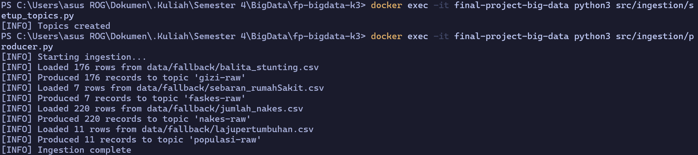

## 2. Bronze Layer
Setelah data ingestion, dataset kemudian disimpan ke HDFS (Hadoop Distributed File System) berupa data raw file .parquet dan siap untuk diproses ke layer berikutnya.
**Tujuan:** Menyimpan data mentah persis seperti diterima dari sumber, tanpa transformasi apapun.
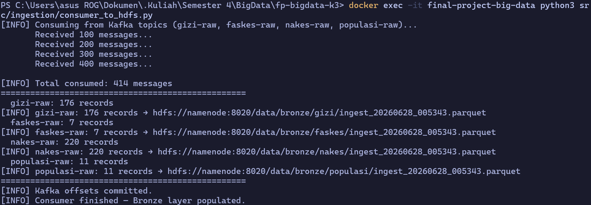
Berikut adalah data-data yang sudah tersimpan di HDFS.
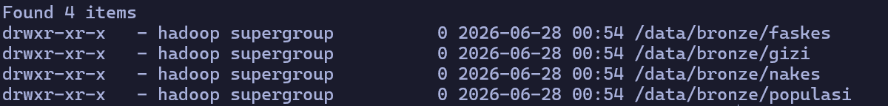

## 3. Silver Layer
Dalam layer ini, dilakukan data cleaning.
**Tujuan:** Membersihkan, menstandarisasi, dan menormalkan data dari semua sumber agar siap digabungkan.

**Transformasi yang dilakukan di Silver:**

| Masalah | Solusi |
|---|---|
| Nama wilayah tidak konsisten ("JAKARTA PUSAT" vs "Jakarta Pusat" vs "Jak-Pus") | Standarisasi ke uppercase + mapping dictionary |
| Granularitas berbeda (gizi & nakes per kecamatan, faskes & populasi per kabupaten/kota) | Agregasi gizi & nakes ke level kabupaten/kota dengan SUM/COUNT |
| Periode data berbeda antar dataset | Tambah kolom `periode_label` yang distandarisasi, flag data dengan `data_vintage` |
| Nilai null/missing | Impute dengan median per wilayah atau flag sebagai `NULL_FLAG=True` |
| Duplikat record | Deduplicate berdasarkan composite key (wilayah + periode + kategori) |
| Satuan populasi (ribuan jiwa) | Konversi ke jiwa absolut (`population_thousand × 1000`) |


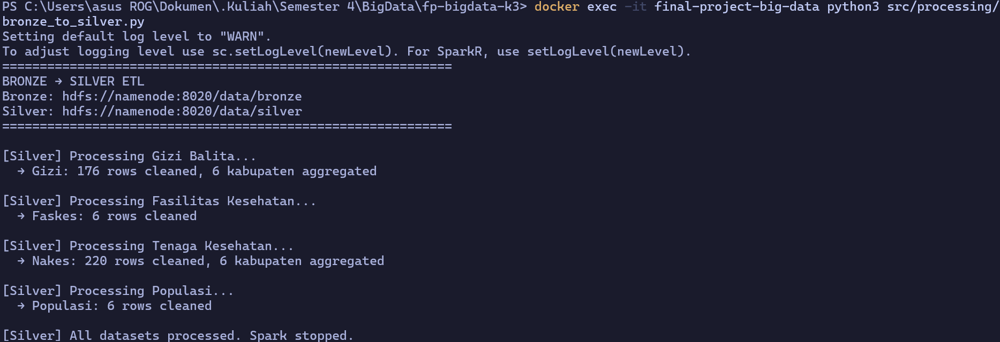
Hasil data yang tersimpan pada silver layer adalah berikut.
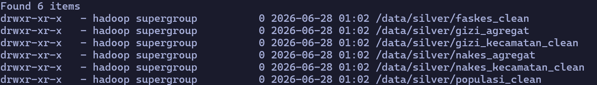

## 4. Gold Layer
**Tujuan:** Output final yang siap dikonsumsi oleh serving layer dan analisis ML.

**Transformasi yang dilakukan di Gold:**

1. **Penggabungan 4 tabel silver** berdasarkan kolom `kabupaten_kota` - `populasi_clean`, `gizi_agregat`, `faskes_clean`, dan `nakes_agregat`

2. **Perhitungan Rasio Indikator:**
   - `rasio_faskes_per_10k_balita` = (total_rs_umum + total_rs_khusus) / (total_balita_gizi_buruk / 10000)
   - `rasio_posyandu_per_10k_populasi` = total_posyandu / (populasi / 10000)
   - `rasio_nakes_per_10k_populasi` = total_nakes / (populasi / 10000)
   - `prevalensi_stunting_pct` = (total_stunting / populasi) × 100
   - `nutrition_coverage_index (NCI)` = rata-rata tertimbang dari rasio-rasio faskes dan nakes

3. **Normalisasi:** 
    - Setiap indikator dinormalisasi ke rentang [0, 1] menggunakan min-max normalisasi via Spark Window function (global across semua wilayah).

4. **Nutrition Risk Score (NRS):**
   ```
   NRS = (w1 × norm_stunting) + (w2 × norm_inverse_faskes) + (w3 × norm_inverse_nakes)
   ```
   Di mana `norm_*` adalah min-max normalization (0–1) dan `w1=0.5, w2=0.3, w3=0.2` (dapat di-tune).
   NRS range 0–1, semakin tinggi = semakin berisiko.

Data yang tersimpan pada Gold Layer.
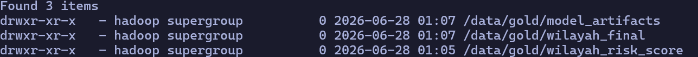

## 5. ML Analysis

### 5.1 K-Means Clustering (PySpark MLlib)

**Tujuan:** Mengelompokkan 6 kabupaten/kota DKI Jakarta ke dalam kategori risiko berdasarkan gabungan fitur gizi dan ketersediaan layanan.

**Hasil K-Means Clustering** (kolom tambahan):
   - `cluster_id` : integer (0, 1, 2)
   - `cluster_label` : string ("Risiko Rendah", "Risiko Sedang", "Risiko Tinggi")

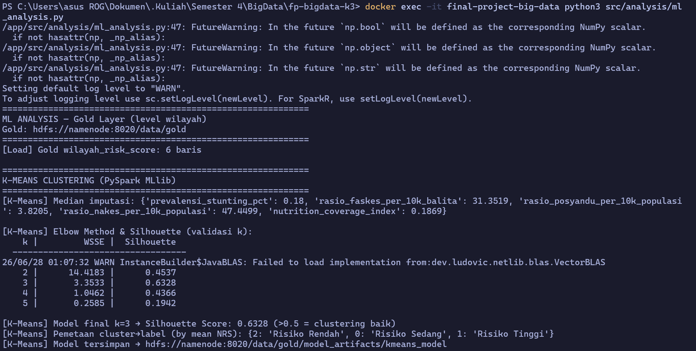
k=3 dipilih berdasarkan Elbow Method, karena WSSE turun drastis dari k=2 -> 3. **Pelabelan cluster** dilakukan secara dinamis berdasarkan rata-rata NRS tiap cluster (bukan pelabelan manual).


**Hasil pemetaan cluster:**
| Cluster | Label | NRS | Wilayah |
| --- | --- | --- | --- |
| Cluster 2 | Risiko Rendah | 0.13 – 0.17 | Jakarta Pusat, Jakarta Selatan |
| Cluster 0 | Risiko Sedang | 0.47 – 0.64 | Jakarta Barat, Jakarta Utara, Jakarta Timur |
| Cluster 1 | Risiko Tinggi | 0.9171 | Kepulauan Seribu |

### 4.2 Isolation Forest - Anomaly Detection (scikit-learn)

**Tujuan:** Mendeteksi wilayah yang memiliki pola tidak wajar — misalnya angka stunting sangat tinggi tapi rasio faskes juga sangat rendah (double anomali yang memerlukan intervensi segera).

**Hasil Isolation Forest** (kolom tambahan):
   - `is_anomaly` : boolean
   - `anomaly_score` : float (semakin negatif = semakin anomali)

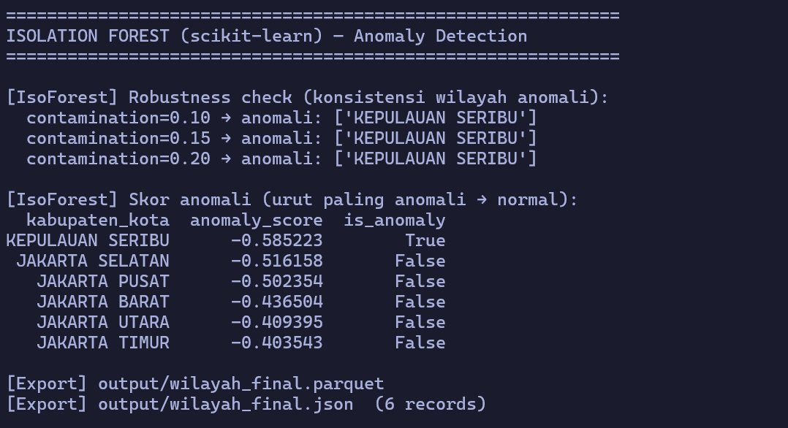
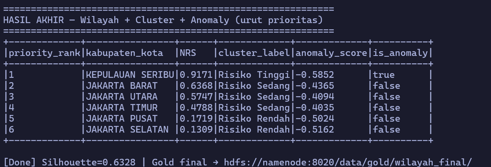

Kepulauan Seribu konsisten terdeteksi sebagai anomali di semua nilai contamination, mengindikasikan profil risiko yang sangat berbeda dari lima wilayah Jakarta lainnya. Kemungkinan besar karena keterbatasan layanan akses kesehatan akibat kondisi wilayah geografis.

## 6. Dashboard
Setelah melakukan langkah-langkah pada [Command Documentation](#command-documentation) dashboard akan muncul pada localhost:5000.


**Dokumentasi Dashboard:**
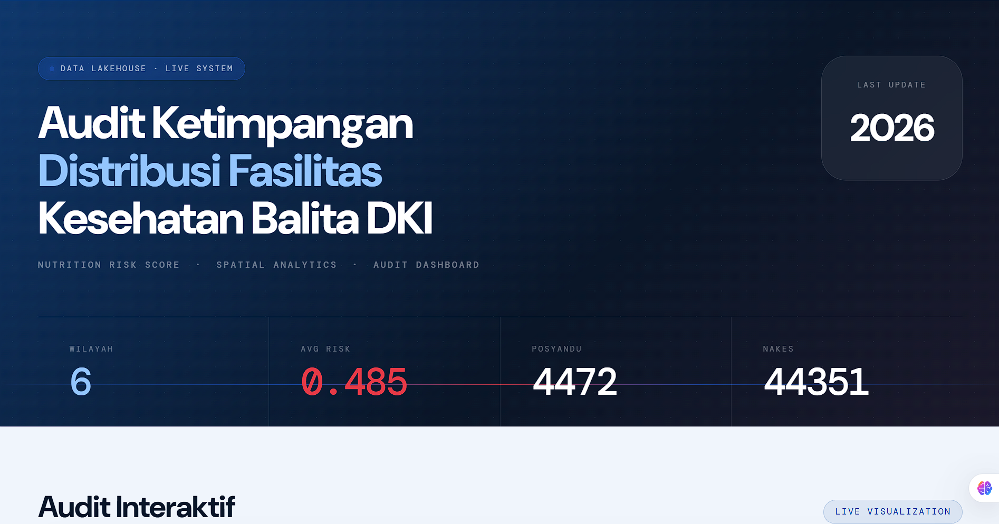
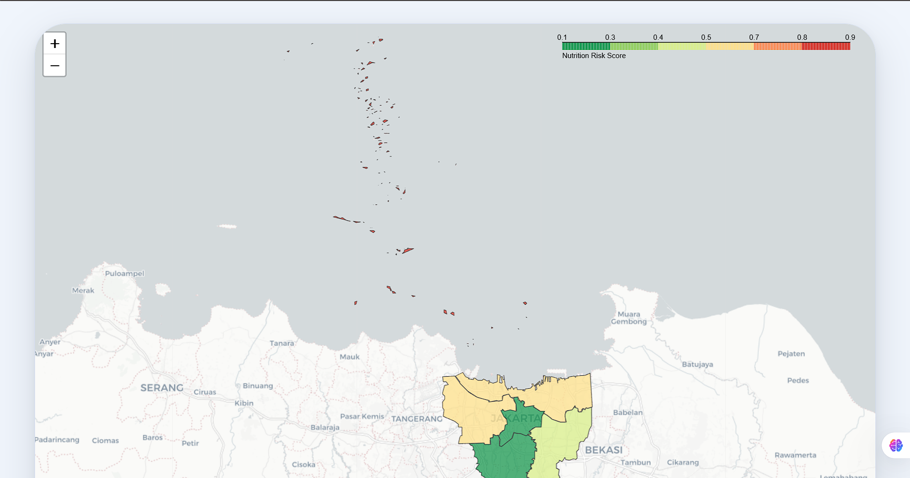
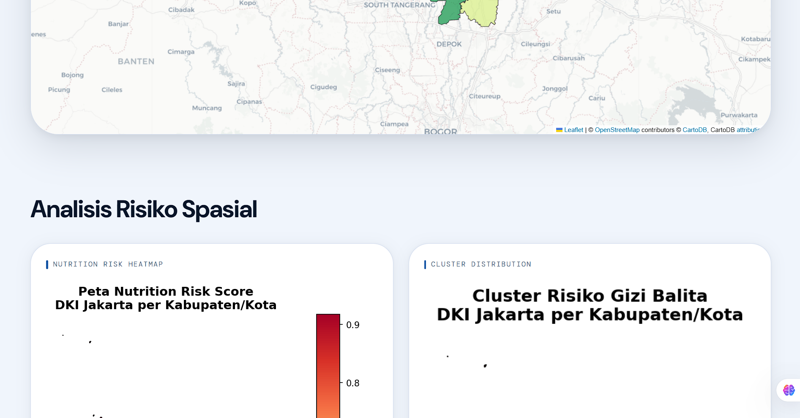
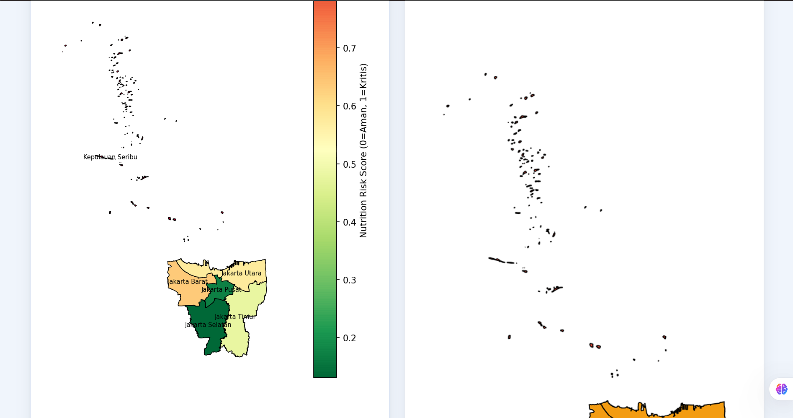
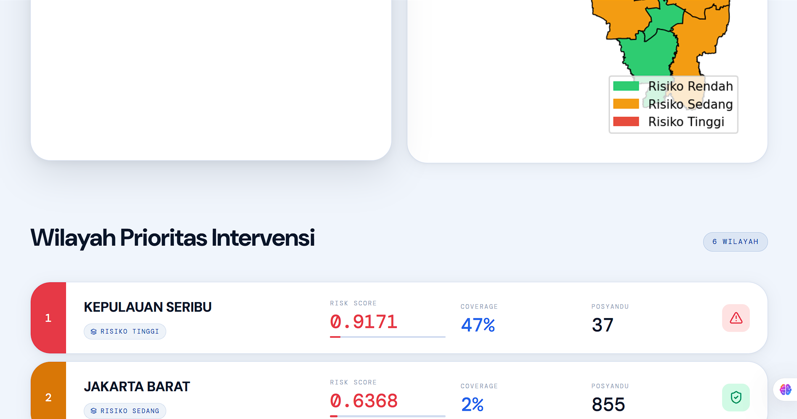
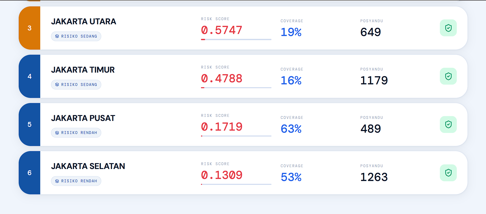
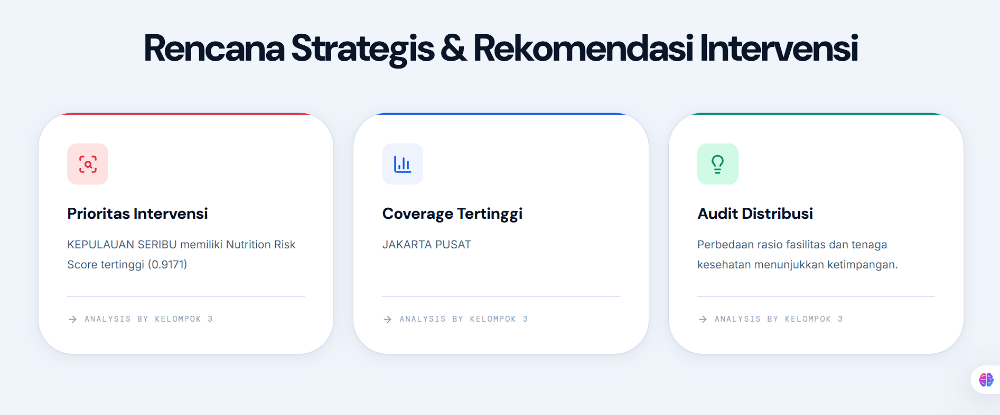